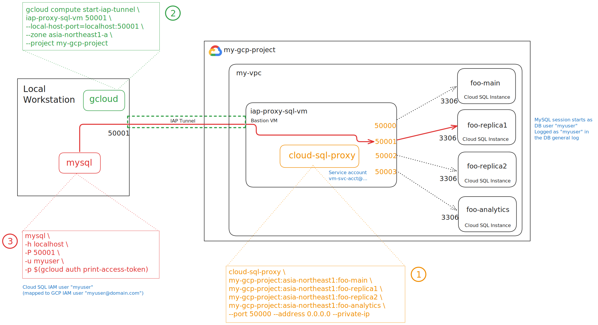

# gcp-cloud-sql-iap-proxy

Creates a small Compute Engine VM to act as a shared bastion host for the Cloud SQL Auth Proxy. This module is designed to be used with **Cloud SQL IAM Authentication**.

This module allows authorized users to connect to private Cloud SQL instances by running the proxy on a central VM. Access to the VM's proxy ports is secured using **Google's Identity-Aware Proxy (IAP) TCP tunneling**, which means the bastion host itself requires no public IP address.

### Authentication Model

This module enables a two-step authentication chain that provides both security and end-user auditing:

1.  **Transport Layer (You -> Bastion):** Your connection from your local machine to the bastion VM is authenticated and encrypted by **IAP** using your `gcloud` credentials (requires `roles/iap.tunnelUser`).
2.  **Application Layer (You -> Database):**
    * The Cloud SQL Proxy on the VM authenticates to Cloud SQL using its own **Service Account** (created by this module).
    * When you connect, your client sends your **IAM access token** (from `gcloud auth print-access-token`) as a password.
    * The proxy validates this token and asserts your IAM identity to the database.
    * This allows your individual IAM identity to appear in the database's internal logs (like `mysql-general.log`), just as you observed.

---

## Important Prerequisites

Before you can connect, you **must** have the following configured in your GCP project:

1.  **Enable IAM Authentication:** You must [enable the "Allow IAM authentication" flag](https://cloud.google.com/sql/docs/mysql/iam-authentication) on your Cloud SQL instances.

2.  **Create IAM Database Users:** You must [add your IAM users](https://cloud.google.com/sql/docs/mysql/add-iam-user) to the database.

3.  **End-User IAM Roles:** Your end-users (e.g., `yourname@domain.com`) must have the `roles/cloudsql.instanceUser` permission on the project.

---

## How to Connect

After the module is applied, connecting to your database is a three-step process:

1.  **Start the IAP Tunnel:**
    * Ensure your local `gcloud` user has the `roles/iap.tunnelUser` permission on the project.
    * Run the command for your target database provided by the `output.sql_proxy_tunnel_commands`. This will securely forward the proxy port from the VM to your local machine (`localhost`).
    * You will see a map of commands, one for each instance in your `var.cloud_sql_instances` list.

    ```sh
    # Example command from the output:
    gcloud compute start-iap-tunnel iap-bastion-host 50000 --local-host-port=localhost:50000 --zone us-central1-a --project my-project
    ```
    > **Keep this terminal window open.** The tunnel will close when you exit the command.

2.  **Get Your Access Token:**
    * In a **new** terminal, get a short-lived access token:
    ```sh
    gcloud auth print-access-token
    ```
    * Copy the long token string. This is your password.

3.  **Connect Your Database Client:**
    * In a separate terminal or database client, configure your connection settings.
    * **Host:** `localhost`
    * **Port:** The port you are forwarding (e.g., `50000` from the example above). You can see all assignments in the `output.instance_port_assignments`.
    * **Username:** Your IAM user's short name (e.g., `yourname` for the IAM user `yourname@domain.com`).
    * **Password:** The access token you copied in Step 2.
    * **Note for MySQL:** You may need to enable a "cleartext" password plugin.

---

## 🚀 Module Usage Examples

### Minimal Example (Required Variables Only)

This example connects to two Cloud SQL instances, which will be mapped to ports `50000` and `50001` respectively.

```hcl
data "google_compute_subnetwork" "my_subnetwork" {
  name   = "my-private-subnet"
  region = "us-central1"
}

module "sql_bastion" {
  source = "github.com/jtreutel/gcp-cloud-sql-iap-proxy?ref=vX.Y.Z" #Replace with actual tag

  cloud_sql_instances  = ["my-mysql-db", "my-postgres-db"]
  starting_port        = 50000
  network_name         = "my-production-vpc"
  subnetwork_self_link = data.google_compute_subnetwork.my_subnetwork.self_link
}
````

### Full Example (All Variables Overridden)

This example customizes all available options and opens an additional port (`22` for SSH).

```hcl
data "google_compute_subnetwork" "my_subnetwork" {
  name   = "my-staging-subnet"
  region = "asia-northeast1"
}

module "sql_bastion_custom" {
  source = "github.com/jtreutel/gcp-cloud-sql-iap-proxy?ref=vX.Y.Z" #Replace with actual tag

  # --- Required ---
  cloud_sql_instances  = ["staging-main-db", "staging-analytics-replica"]
  starting_port        = 60000
  network_name         = "my-staging-vpc"
  subnetwork_self_link = data.google_compute_subnetwork.my_subnetwork.self_link

  # --- Optional ---
  name_prefix                  = "dev-"
  instance_name                = "stg-sql-bastion"
  machine_type                 = "e2-small"
  boot_image                   = "ubuntu-os-cloud/ubuntu-2404-lts"
  cloud_sql_proxy_version      = "v2.19.0" 
  iap_ssh_tag                  = "allow-stg-iap"
  firewall_name                = "allow-stg-iap-fw-rule"
  firewall_additional_ports    = ["54321"]  #arbitrary ports
  iap_source_range             = ["35.235.240.0/20"]
  service_account_id           = "staging-sql-bastion-sa"
  service_account_display_name = "Staging SQL Bastion SA"
  service_account_role         = "roles/cloudsql.client"
}
```

-----

## Architecture Digram

1. [Orange] cloud-sql-proxy server
2. [Green] IAP tunnel creation
3. [Red] User database connection
4. [Blue] Identity flow



-----

## Inputs

### Required

| Name | Description | Type | Default |
| :--- | :--- | :--- | :--- |
| `instance_name` | Name of the IAP bastion host VM. | `string` | n/a |
| `cloud_sql_instances` | List of Cloud SQL instance **names (IDs)**. Project and region are detected automatically. | `list(string)` | n/a |
| `starting_port` | The starting TCP port for the proxy to listen on. Subsequent instances will use incremented ports (e.g., 50000, 50001, 50002). | `number` | n/a |
| `network_name` | The name of the VPC network to attach the VM to. | `string` | n/a |
| `subnetwork_self_link` | The self-link of the subnetwork to attach the VM to. | `string` | n/a |

### Optional

| Name | Description | Type | Default |
| :--- | :--- | :--- | :--- |
| `name_prefix` | Prefix to add to all resource names. | `string` | `""` |
| `machine_type` | Machine type for the IAP bastion host. | `string` | `"e2-micro"` |
| `boot_image` | The boot image for the VM, e.g., 'ubuntu-os-cloud/ubuntu-2204-lts'. | `string` | `"ubuntu-os-cloud/ubuntu-2204-lts"` |
| `cloud_sql_proxy_version` | The version of the Cloud SQL Proxy to install. | `string` | `"v2.19.0"` |
| `iap_ssh_tag` | The network tag used to identify VMs for IAP firewall rules. | `string` | `"allow-iap-ssh"` |
| `firewall_name` | The name of the firewall rule that allows IAP access. | `string` | `"allow-iap-ssh-to-tagged-vms"` |
| `firewall_additional_ports` | List of additional ports to allow from the IAP service. | `list(string)` | `[]` |
| `iap_source_range` | The official source IP range for Google's IAP service. | `list(string)` | `["35.235.240.0/20"]` |
| `service_account_id` | The account\_id for the bastion's service account. | `string` | `"sql-iap-bastion-sa"` |
| `service_account_display_name` | The display name for the bastion's service account. | `string` | `"Service Account for SQL IAP Bastion"` |
| `service_account_role` | The IAM role to grant to the service account. | `string` | `"roles/cloudsql.client"` |

-----

## Outputs

| Name | Description |
| :--- | :--- |
| `ssh_command` | Command to SSH into the bastion host using IAP. |
| `sql_proxy_tunnel_commands` | A map of Cloud SQL instance names to the `gcloud` commands to start their IAP tunnels. |
| `instance_port_assignments` | A map of Cloud SQL instance names to their assigned local proxy ports on the bastion. |
